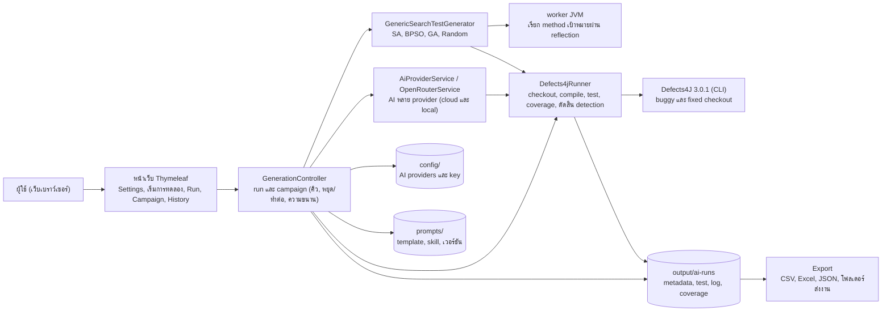
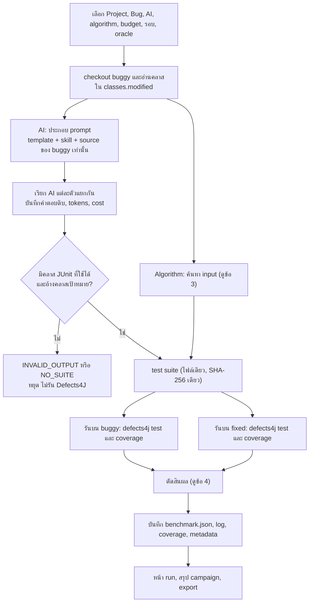
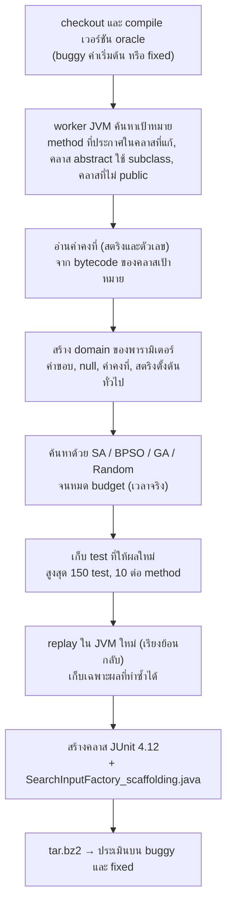
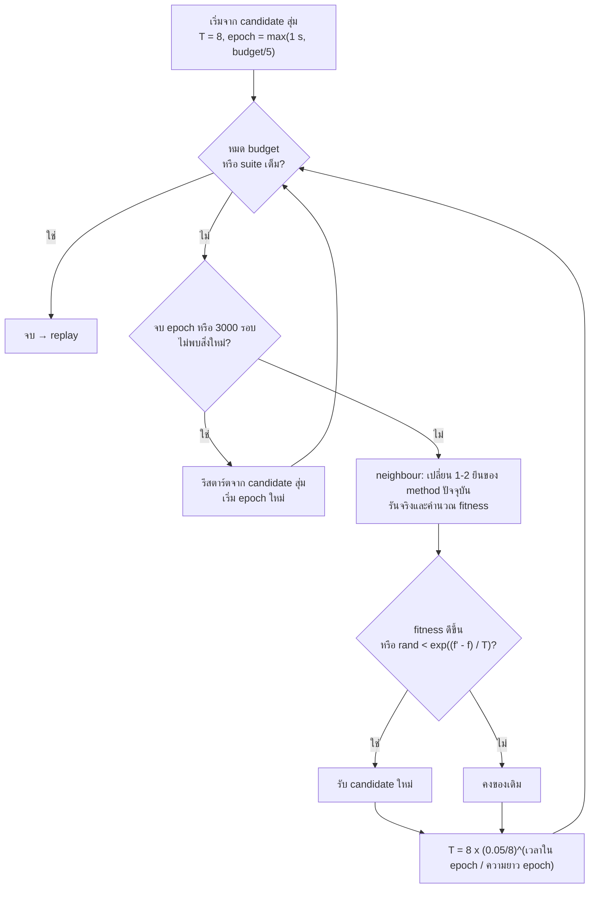
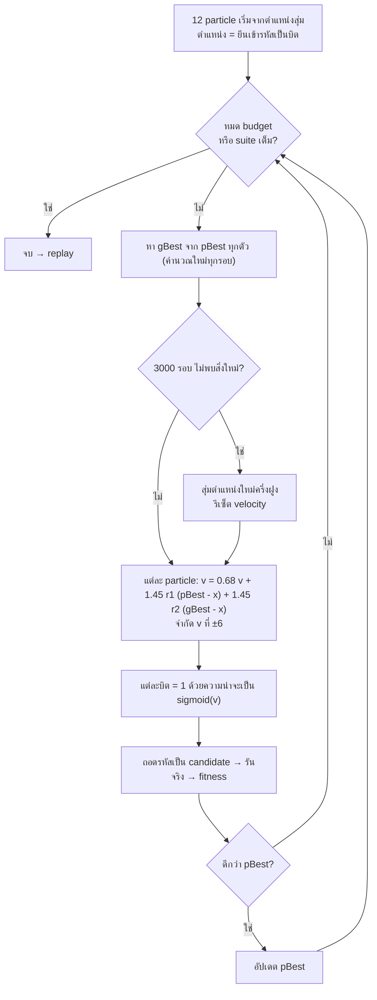
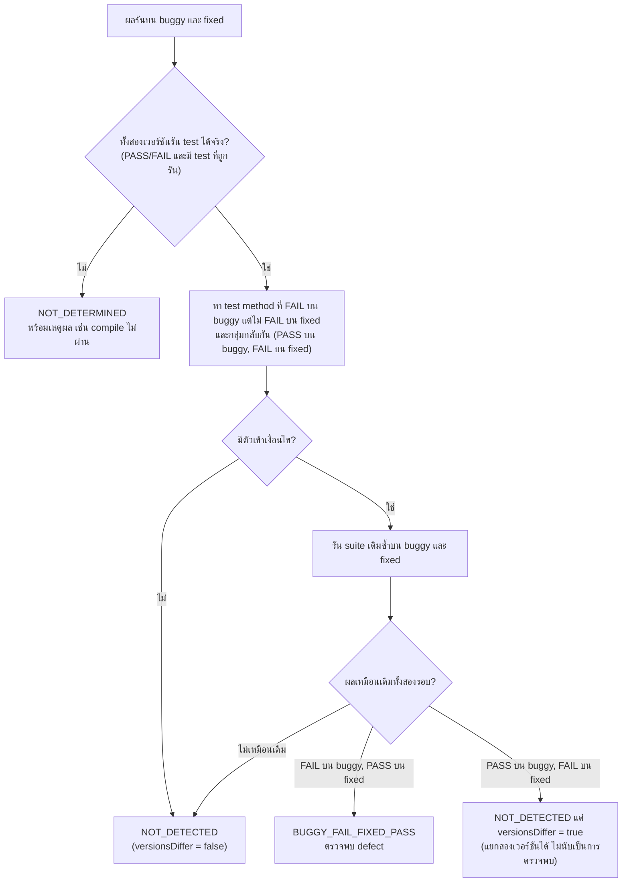
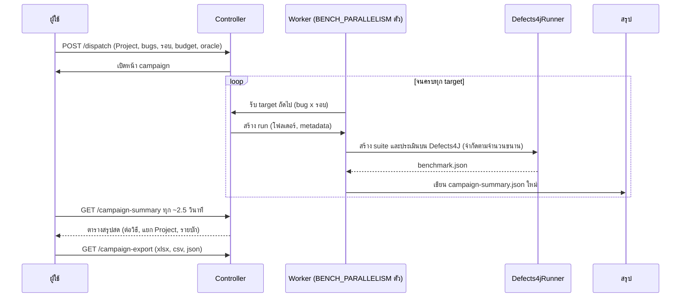
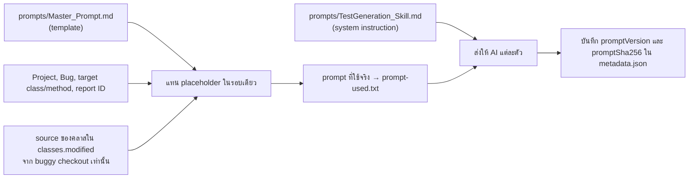

# สถาปัตยกรรมและ diagram

diagram ทั้งหมดเขียนด้วย [Mermaid](https://mermaid.js.org/) (แสดงผลบน GitHub ได้โดยตรง) ตรงกับโค้ดปัจจุบัน

## 1. ภาพรวมระบบ

## 2. ขั้นตอนของหนึ่ง run (ต่อหนึ่ง bug ต่อหนึ่งรอบ)

AI และ algorithm เริ่มพร้อมกัน แยกกันสร้าง suite แล้วเข้าขั้นประเมินคู่เดียวกัน

## 3. Pipeline ของ algorithm (SA, BPSO, GA, Random ใช้ร่วมกัน)

### 3.1 Simulated Annealing

### 3.2 Binary PSO

## 4. การตัดสินผลหลังรัน buggy และ fixed

## 5. Campaign (หลาย bug / หลายรอบ)

## 6. การประกอบ prompt ของ AI

ไม่มี patch, ไม่มี source ของ fixed และไม่มี test เดิมของ Defects4J อยู่ในข้อมูลที่ส่งให้ AI
